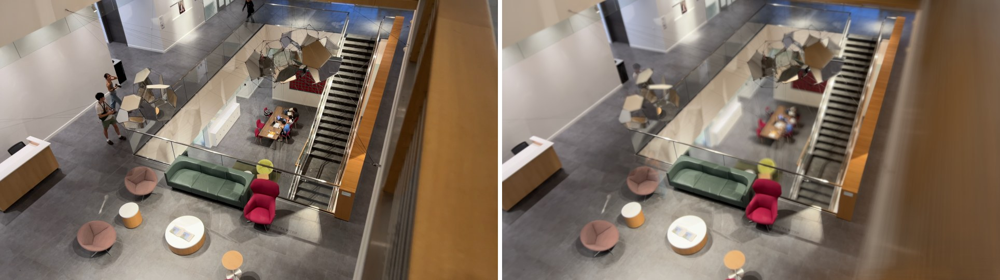
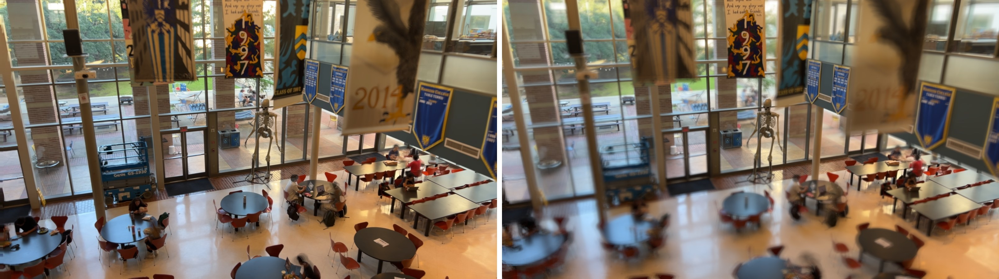

<p align="center">
  
</p>

<h1 align="center">Synthetic Aperture Tilt-Shift</h1>

<p align="center">
  Turn handheld phone video into tilt-shift photography.<br>
  Choose the focus plane in post.
</p>

<p align="center">
  <a href="https://aperture-tilt-shift.vercel.app"><b>Live demo</b></a> ·
  <a href="docs/report.pdf">Write-up</a>
</p>



Basically, a real DSLR lens averages the views from every point across its aperture. On the other hand, a phone's aperture is a few millimetres wide, so
nothing blurs. To mimic DSLR, move the phone across a disc while it records
so each frame is one view from one point of a much larger aperture.
Align the frames then average them to output photograph.

Two views of any plane are related
by a homography that depends only on the camera motion, the intrinsics and the
plane itself:

```
H = K (R + t nᵀ / d) K⁻¹
```
A point at depth *z* smears over `D · f · |1/z − 1/z₀|` pixels.



## Using it

You need [ffmpeg](https://ffmpeg.org) and [uv](https://docs.astral.sh/uv/).

```
brew install ffmpeg uv
uvx --from git+https://github.com/danielhkuo/aperture-tilt-shift sa gui
```

A low-resolution preview updates in about a tenth of a second; a full 4K render
takes a few seconds.

View at demo at [aperture-tilt-shift.vercel.app](https://aperture-tilt-shift.vercel.app) which has some pre-rendered in WebGL. Alternatively you can run the helper on your own mac.

```
sa ingest  clip.MOV --every 5              # video → frames/
sa pose    clip/                           # COLMAP → poses.json
sa plane   clip/ --tilt 30 --dist 300      # or --pick to click three points
sa render  clip/ --aperture 0.8            # warp + average → renders/
sa render  clip/ --tilt 0:60:10            # a sweep, one pass over the frames
sa export  clip/ --out web/scenes/clip     # bundle for the browser renderer
```

## Shooting

- 4K, 1× lens, focus and exposure locked, HDR video off.
- Keep the phone pointed at the same spot and *move* it: spiral outward from
  the centre over 10–20 seconds, as wide as you can reach.
- The scene needs depth, so ideally you'd be looking down from a height at things five to
  fifteen metres away works well.
- Static subjects. Anyone who walks through the shot averages into a ghost.

```
uv run pytest
```

Built for ELEC 549 at Rice University. The synthetic-aperture idea follows
Marc Levoy's SynthCam; camera poses come from
[COLMAP](https://colmap.github.io).
