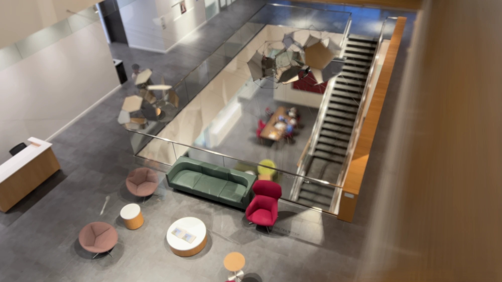
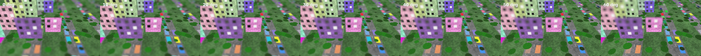

# Synthetic Aperture Tilt-Shift from a Handheld Phone Video

ELEC 549 project report · Daniel Kuo · 22 September 2026

## 1. Creative goal

I wanted one photograph of a real place whose plane of focus is *tilted through the scene*, taken with nothing but an iPhone. A tilt-shift lens can do this and it is what gives the miniature, model-village look; a phone lens cannot, and app filters only paint a blur band across the picture. The goal was the real optical effect: every object blurred by its true distance from a plane chosen after the fact.

The final image looks down at an angle from an upper floor of O'Connor into the two-storey lobby. The focus plane lies along the upper floor, so the lounge furniture is sharp while the study table one floor below, the stairs and the column beside the camera fall away from the plane and blur. No blur filter was applied.

## 2. How it works

A wide aperture averages the views from every point across its opening: objects on the focus plane coincide in all views and stay sharp, objects off it land in different places and smear. A phone aperture is a few millimetres wide, so nothing smears. Instead I moved the phone over a disc about an arm's reach across while recording video; each frame is one view from one point of a very large aperture, and averaging the frames reproduces what a lens that size would do (Levoy's SynthCam idea).

Alignment selects the focus plane. Two views of any plane are related by a homography that depends only on camera motion (R, t), intrinsics K and the plane (n, d):

    H = K (R + t n^T^ / d) K^-1^

Nothing here requires the plane to be visible or textured: pick any (n, d), warp every frame by its H, average, and that plane comes out sharp. Tilting the plane is just changing n. A point at depth z blurs over roughly b = D f |1/z − 1/z~0~| pixels, the circle-of-confusion formula with the sweep diameter D standing in for the aperture.

## 3. Capture

iPhone, 4K at 24 fps, 1× lens. Each take is 42–50 s of video with the phone translated over a spiral while pointing the same way; every 5th frame is kept (203–240 frames per take).

| Take | Scene | Registered | Outcome |
| --- | --- | --- | --- |
| C001 | O'Connor lobby from an upper floor | 213 / 213 | Final image (Fig. 1) |
| C003 | Commons dining hall from the balcony | 221 / 221 | Two tilt directions (Fig. 3) |
| C002 | Quad from a roof, ~50 m away | 240 / 240 | Blur too small at that distance |
| C004 | O'Connor lobby, second take | 6 / 203 | Pose failed; discarded |

## 4. Technical steps

I wrote a small Python tool, `sa`, with one command per stage; every stage logs its parameters to `run.json`.

| Stage | Tool | What it does |
| --- | --- | --- |
| ingest | ffmpeg | HEVC .mov → PNG frames, every Nth frame |
| pose | pycolmap (COLMAP, CPU) | SIFT, sequential matching, incremental mapping → K, R and t per frame, sparse cloud |
| plane | numpy | Click to focus at a point's depth, then set tilt and azimuth; or fit a plane through three clicked points |
| render | OpenCV | Undistort, linearise, warp each frame by its H, accumulate in float with a weight mask, re-encode |
| gui | FastAPI + WebGL | Browser page with a live preview; the renderer also runs as a GPU shader online |

**Conventions.** The output is rendered from the frame nearest the centre of the sweep, and the plane lives in that camera's coordinates. COLMAP poses are world-to-camera, so the homography carries a plus sign, K(R + t n^T^/d)K^-1^; a synthetic test with known poses pinned this down before any real footage.

**COLMAP retuned for a hand sweep.** Its defaults expect photos metres apart. A sweep subtends one or two degrees at the scene, below the 16° minimum triangulation angle for the initial pair, so the mapper found no initial pair. Lowering that gate to 2° and the triangulation angles to 0.2° made reconstruction work. The focal length is weakly constrained in this regime, so it is seeded at 0.75 × image width.

**Linear light.** Averaging gamma-encoded frames darkens the blurred regions, so frames are decoded to linear light, accumulated, and re-encoded once. A weight image keeps the borders from darkening.

**Aperture.** A control keeps only frames whose camera centre lies within a fraction of the sweep radius, stopping the synthetic lens down.

**Online demo.** Pose is solved once and rendering is cheap, so the render stage was ported to a WebGL shader (about 3 ms per image). The demo is at https://aperture-tilt-shift.vercel.app; source at https://github.com/danielhkuo/aperture-tilt-shift.

## 5. The final image in numbers

From `run.json` for take C001. Reconstruction units are arbitrary; blur in pixels only needs the ratio D/z.

| Quantity | Value |
| --- | --- |
| Frames | 213 kept (every 5th of 1065), 213 registered |
| Intrinsics | f = 2658 px, radial k = 0.015, reprojection error 1.27 px |
| Sweep diameter | 10.4 units; aperture 0.8 keeps 169 frames, effective D = 7.8 |
| Scene depth | 230–640 units (5th–95th percentile), median 347 |
| Focus plane | tilt 26°, azimuth 351°, depth 284 at the pivot (upper floor by the sofa) |

Predicted blur b = D f |1/z − 1/z~0~|: 0 px at the pivot, 1 px at the top of the stairs, 10 px at the reception desk, 33 px at the table on the lower floor (at 4K).

## 6. Validation

On a synthetic city rendered from known poses, COLMAP recovered f = 1001 px against a true 1000 and registered all 60 frames; three clicked ground points gave a plane tilted 54.8° against the true 55°. A second test renders dots at known depths by direct point projection (sharing no code with the homography): measured blur matches D f |1/z − 1/z~0~| within 6 %, and a template-matched shift-and-add agrees with the pose-derived warp to within 1 grey level.

## 7. What I learned

**The scene is the main failure mode.** Blur scales with D/z, so two floors seen from above work and a distant quad barely does. The 33 px predicted for the lower floor was visible but modest; a wider sweep would strengthen the effect.

**Small-baseline structure-from-motion is fragile.** C004 registered 6 of 203 frames, and the first pose run on C001 also registered only 6 before a rerun with identical settings registered all 213. COLMAP's initial-pair search is randomised and a sweep gives it little angle to work with.

**Focal length is poorly determined.** The same phone came out at 2658, 2697 and 2752 px across takes. Renders of a plane picked in the same reconstruction are unaffected, but numeric tilt angles are biased.

**Moving people ghost rather than blur** (Figures 2 and 3). A median would drop them at the cost of changing the blur's character.

**Stopping down trades blur for sharpness on the plane.** The final renders use the inner 50–90 % of the sweep: pose error grows toward its ends, so the outermost frames cost more sharpness on the plane than they add in blur off it.

**Gamma matters in practice.** The transfer-curve material from class became a design decision and a unit test.

**The plane really can go where a lens cannot.** Because the warp comes from pose rather than image content, the plane in Figure 3 (right) passes through the empty air of the atrium, the case a feature-tracking approach cannot handle.
